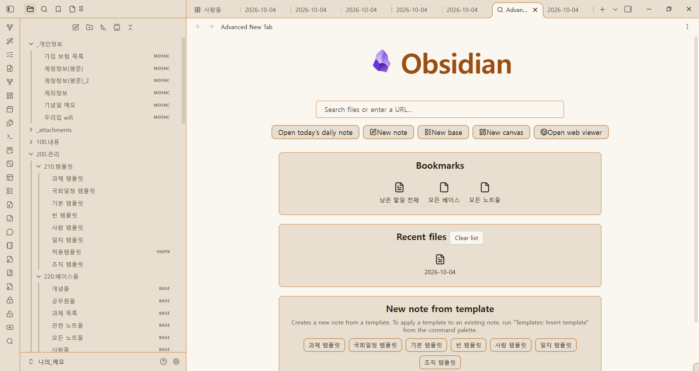
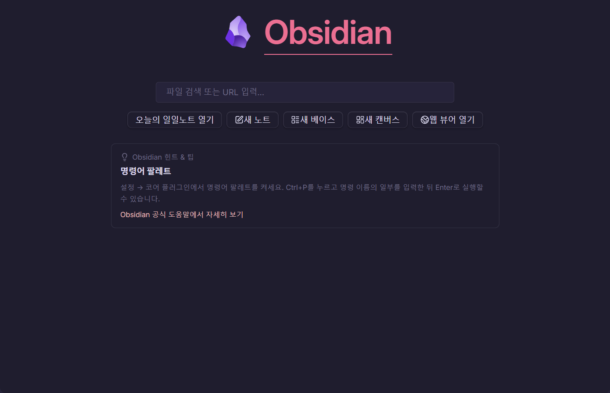

# Advanced New Tab

빈 탭에서 파일 검색, 북마크·최근 파일 열기, 템플릿으로 새 노트 생성을 제공합니다.

**Advanced New Tab의 목적은 Obsidian 초보자가 앱을 쉽게 이용하도록 돕는 것입니다.** 자주 쓰는 작업을 한곳에 모으고 짧은 힌트와 팁으로 기본 기능과 코어 플러그인을 익히도록 안내합니다.



**이 프로젝트는 [olrenso/obsidian-home-tab](https://github.com/olrenso/obsidian-home-tab)을 fork하여 작성했습니다.** 원저작자의 저작권 고지를 유지하며 MIT 라이선스로 배포합니다.

[English](README.md)

## 현재 상태

Obsidian 커뮤니티 플러그인에서 **Advanced New Tab**을 검색해 설치할 수 있으며, [GitHub Releases](https://github.com/EverydayMind/obsidian-advanced-new-tab/releases)에서도 설치 파일을 제공합니다. 최소 Obsidian 버전은 **1.13.0**입니다. 초보자 팁은 Windows의 실제 Obsidian 1.14.4에서 한국어·영어, 밝은·어두운 테마, 390 px 에뮬레이션 화면으로 검증했습니다. 실제 모바일 기기와 최소 지원 버전 검증은 남아 있습니다.

홈 화면·설정·메뉴·안내 메시지는 앱 언어를 따르며 영어·한국어를 직접 선택할 수도 있습니다. 설정은 Obsidian 1.13의 검색 가능한 선언형 API를 사용합니다.

## 사용법

- 새 빈 탭을 자동으로 시작 화면으로 바꾸거나 명령어 팔레트·리본에서 직접 엽니다.
- 파일 이름과 별칭을 검색합니다. `md`, `image`, `pdf`, `canvas`, `base` 등의 필터 키를 입력하고 Tab을 누릅니다. 빈 입력에서 Backspace로 해제합니다.
- 방향키로 선택, Enter로 열기, Ctrl/Cmd+Enter로 새 탭에 열기, Shift+Enter로 새 노트를 생성합니다. 기본 전역 단축키는 지정하지 않습니다.
- HTTP(S) URL 또는 도메인을 입력하면 **Web viewer 코어 플러그인**으로 엽니다. 일반 선택은 현재 탭, Ctrl/Cmd 선택은 새 탭을 사용합니다. 데스크톱에서 Web viewer를 켜야 하며, 사용할 수 없으면 안내를 표시합니다. 기본·Omnisearch·Surfing 검색 모드 모두 같은 경로를 사용합니다.
- 북마크·최근 파일·템플릿·빠른 작업·초보자 팁·리본 아이콘을 각각 표시하거나 숨길 수 있습니다.
- Omnisearch와 Surfing 선택 연동을 유지합니다.
- 헤딩 검색을 켜면 로컬 검색 결과에서 선택한 헤딩으로 이동합니다. Omnisearch 결과에는 영향을 주지 않습니다.
- `template` 또는 `tpl` 입력 후 Tab을 누르면 설정된 템플릿만 검색합니다. Enter로 새 노트를 만들며 Ctrl/Cmd+Enter는 새 탭에 엽니다. 템플릿 필터에서는 Shift+Enter로 빈 노트를 만들지 않습니다.

## 빠른 작업과 섹션 순서

기본 새 노트·일일 노트 버튼에 사용자 지정 명령 또는 보관함 파일 바로가기를 추가할 수 있습니다. 설정의 사용자 지정 빠른 작업에서 명령을 검색하거나 파일을 선택하고 버튼 이름·아이콘 ID·새 탭 여부를 설정합니다. 목록을 끌어 순서를 바꾸거나 삭제 버튼으로 제거합니다. 대상 파일이나 명령을 사용할 수 없으면 안내합니다.

폴더 위치 표시·웹 뷰어로 URL 열기·특정 템플릿으로 새 노트 종류도 선택할 수 있습니다. 폴더는 파일 탐색기 코어 플러그인, URL은 데스크톱 웹 뷰어가 필요합니다.

‘새 노트’, ‘새 베이스’, ‘새 캔버스’, ‘웹 뷰어 열기’는 기본 새 탭과 같은 코어 명령과 클릭 보조 키를 사용하므로 파일 생성 설정과 웹 뷰어 홈페이지도 Obsidian 설정을 따릅니다. ‘새 노트’는 항상 표시되며, 나머지는 해당 코어 플러그인이 활성화된 경우에만 나타납니다.

섹션 순서 목록에서 북마크·최근 파일·템플릿 순서를 바꿉니다. 중첩된 코어 북마크 그룹의 파일도 표시합니다. Advanced New Tab이 활성화된 동안 검색창으로 이동 명령을 사용할 수 있습니다.

북마크 그룹을 선택하면 해당 그룹과 하위 그룹만 표시합니다. 그룹 이름을 바꾸면 다시 선택하세요. 호버 미리보기는 북마크·최근 파일 카드에서 페이지 미리보기 코어 플러그인과 해당 보조 키 설정을 사용합니다.

최근 파일은 열람·수정 기준 선택, 상대 시간·전체 상위 폴더 표시, 제외 폴더(줄마다 하나, 하위 폴더 포함)를 지원합니다. 목록 지우기는 실제 파일을 삭제하지 않습니다. 수정 기준에서 숨긴 항목은 해당 세션에서 다시 수정할 때까지 숨기며, 앱 재시작 시 수정 이력을 다시 계산합니다. 열람 이력은 저장 옵션을 켠 경우에만 보존합니다.

## 초보자 힌트 & 팁

새 시작 탭을 열 때마다 파일 섹션 아래에 **36개 팁 중 하나**를 무작위로 표시합니다. 명령어 팔레트, 슬래시 명령, 마크다운, 링크, 검색, 북마크, 일일 노트, 템플릿, 캔버스, 베이스 등 기본 기능과 코어 플러그인을 중심으로 구성했습니다. 같은 세션에서 연속으로 여는 탭은 같은 팁을 반복하지 않습니다. 열린 탭의 팁은 설정이나 표시 언어를 바꾸어도 유지됩니다.

팁은 플러그인의 한국어·영어 표시 언어를 따르며 운영체제에 맞는 기본 단축키와 공식 도움말 링크를 제공합니다. 필요한 기능은 설정 → 코어 플러그인에서 켜세요. 단축키를 변경했다면 설정 → 단축키에서 확인하세요. 코어 검색 예시는 Obsidian의 검색 사이드바에서 사용합니다.

설정의 **초보자 힌트 & 팁 표시**로 숨기거나 표시할 수 있으며 기존 안내문 표시 설정을 이어서 사용합니다. 노트 안에 삽입한 검색 블록에는 팁이 표시되지 않습니다. 전체 [한국어 힌트 & 팁 목록](BEGINNER_TIPS.ko.md)과 [English tip list](BEGINNER_TIPS.md)를 참고하세요.



## 템플릿

Templates 코어 플러그인의 폴더를 사용하거나 `Template folder override`에 직접 지정합니다. 템플릿을 클릭하면 새 노트를 생성하며 Ctrl/Cmd+클릭은 새 탭에 엽니다.

템플릿별 대상 폴더 목록에서 템플릿을 기존 볼트 폴더에 연결할 수 있습니다. 비우면 기본 새 노트 위치, `/`는 볼트 루트입니다. 템플릿·폴더를 이동하면 매핑과 빠른 작업의 경로도 갱신하세요.

공개 Vault API로 파일을 생성합니다. `{{title}}`, `{{date}}`, `{{time}}`, `{{date:FORMAT}}`, `{{time:FORMAT}}`을 지원합니다. 날짜·시간 기본 형식은 Templates 설정을 따르며 없으면 `YYYY-MM-DD`, `HH:mm`입니다. 알 수 없는 변수는 유지하고 Templater 구문은 실행하지 않습니다.

**영어 UI에서도 기존 명명 규칙을 유지합니다.** 템플릿 이름에서 `template`·`템플릿`을 제거하고 ` 이름 (YYMMDD HHmm)`을 붙입니다. `사람 템플릿` → `사람 이름 (260414 1601).md`. 이름이 겹치면 숫자를 붙이고 `{{title}}`에는 최종 이름을 적용합니다.

`New note name format`과 `Words to strip from template name`으로 규칙을 변경할 수 있습니다. 이름 형식에는 `{{template}}`, `{{date:FORMAT}}`, `{{time:FORMAT}}`을 사용합니다. 빈 형식은 기존 규칙을 유지합니다.

## 일일노트 빠른 기록

기본값은 꺼짐입니다. 활성화한 뒤 Alt+Enter를 누르면 검색창 내용을 오늘 일일노트에 목록 항목 하나로 추가합니다. 일일노트 코어 플러그인의 폴더·날짜 형식·템플릿을 사용하며 날짜별 하위 폴더도 생성합니다. 기록 대상 헤딩을 지정하면 해당 섹션 끝에 추가하고, 헤딩이 없으면 만듭니다. 비우면 노트 끝에 추가합니다. 여러 줄 입력은 한 줄로 합칩니다. 일일노트 템플릿도 위 title/date/time 변수를 지원하며 기본 날짜·시간 형식은 YYYY-MM-DD, HH:mm입니다.

기존 노트는 공개 `Vault.process()` API로 수정하고 기록 요청은 순서대로 처리합니다. 저장 성공 후에만 검색창을 비우며 저장 중 새로 입력한 내용은 유지합니다. 실패하면 입력 내용을 보존하여 재시도할 수 있습니다. Alt+Enter를 직접 실행할 때만 일일노트를 수정합니다.

## 노트에 검색창 넣기

````markdown
```advanced-new-tab
show bookmarked files
show recent files
```
````

`only search bar`로 제목·로고를 숨깁니다. 과거 옵션 `show starred files`도 북마크 표시 별칭으로 지원합니다.

뷰 타입은 `advanced-new-tab-view`, 블록 이름은 `advanced-new-tab`이며 CSS도 독립 네임스페이스를 사용합니다. 기존 노트의 `search-bar` 코드 펜스를 `advanced-new-tab`으로 바꾸세요. 원본 블록 이름은 Home tab·Harbor Tab에서 사용할 수 있도록 등록하지 않습니다. 기존 `home-tab-view` 레이아웃은 두 플러그인이 꺼져 있을 때만 이전합니다.

## 설치와 개발

Obsidian의 설정 → 커뮤니티 플러그인 → 탐색에서 **Advanced New Tab**을 검색해 설치하고 활성화하세요. 수동 설치는 [최신 GitHub 릴리스](https://github.com/EverydayMind/obsidian-advanced-new-tab/releases/latest)의 `main.js`, `manifest.json`, `styles.css`를 `.obsidian/plugins/advanced-new-tab/`에 복사합니다.

개발자는 `.nvmrc`의 Node 버전으로 `npm ci`, `npm run lint`, `npm test`, `npm run build`를 실행합니다. PowerShell 실행 정책 때문에 `npm`이 차단되면 `npm.cmd`를 사용합니다. 개발 빌드는 인접 `developmentVault`에 출력합니다.

UI는 Svelte 5의 기존 템플릿 문법과 공개 mount/unmount API를 사용합니다. 실제 DOM 테스트로 바인딩·언어 변경·빠른 작업 클릭·안전한 텍스트 강조·터치 선택을 검증합니다. TypeScript 소스에는 공식 Obsidian lint 규칙을 적용하고 Svelte lint·타입 검사도 실행합니다. 실제 앱 검증과 디렉터리 preview scan은 출시 전에 완료해야 합니다.

코어 플러그인 조회·명령 실행·Omnisearch 조회·Web viewer 뷰 식별자는 공개 SDK 계약이 없어 가용성을 확인하는 호환 계층에 모았습니다. Web viewer 경로는 설치된 Obsidian 1.14.4 코드와 모의 탐색 테스트로 확인했으며 최소 지원 버전의 실제 앱 검증이 남아 있습니다.

`npm run release:check`는 메타데이터 정합성과 추적 금지 파일을 검사합니다. CI는 Windows·Linux에서 clean install·릴리스 검사·린트·테스트·빌드를 실행합니다. manifest와 같은 semver 태그를 push하면 같은 검증 후 설치용 파일 3개에 빌드 attestation을 생성하고 초안 릴리스를 만듭니다. 실제 앱 QA 후 초안을 검토하여 공개하고 커뮤니티 디렉터리의 심사 피드백을 반영합니다.

## 개인정보

텔레메트리와 자체 원격 검색 서비스는 없습니다. 로컬 검색과 노트 생성은 볼트 안에서 이루어집니다. 설정·최근 파일 경로·북마크 아이콘은 플러그인의 `data.json`에 저장합니다.

빠른 기록을 켜고 Alt+Enter를 직접 실행하면 검색창 내용을 오늘 일일노트에 추가합니다. 백그라운드에서 노트 내용을 수정하지 않습니다.

로고 이미지 URL을 지정하면 이미지 요청이 발생합니다. URL 열기·Surfing 검색은 선택한 웹사이트·검색 제공자에 접속합니다. Omnisearch·Surfing의 개인정보 처리는 해당 플러그인의 안내를 따릅니다.

초보자 팁은 로컬에 포함됩니다. 도움말 링크를 클릭할 때만 공식 Obsidian 웹사이트에 접속합니다.

## 기여와 보안

주요 변경은 이슈에서 먼저 논의하고 PR에 변경 이유와 검증 결과를 작성해 주세요. 노트 생성·연동 변경에는 회귀 테스트를 추가합니다. 번역은 `src/i18n/locales`에서 관리하며 없는 번역은 영어로 표시합니다. 저장되는 필터 키·블록 옵션은 번역하지 않습니다.

취약점은 비공개 취약점 신고 기능이 활성화되어 있으면 그 경로로 신고해 주세요. 비공개 경로가 없으면 공개 이슈에 재현 공격이나 개인 볼트 내용을 올리지 말고 비공개 연락 경로를 문의해 주세요.

## 출처와 라이선스

[olrenso/obsidian-home-tab](https://github.com/olrenso/obsidian-home-tab)을 fork하여 작성했습니다. Lorenzo의 Copyright (c) 2023 고지를 보존하고 변경분에 Copyright (c) 2026 everydaymind를 추가했습니다. [MIT 라이선스](LICENSE)가 적용됩니다.
